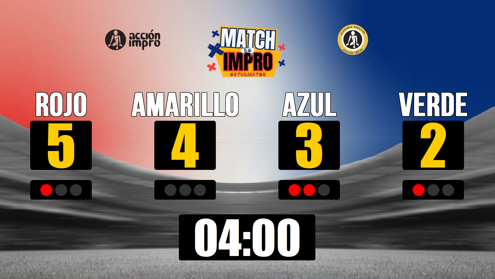
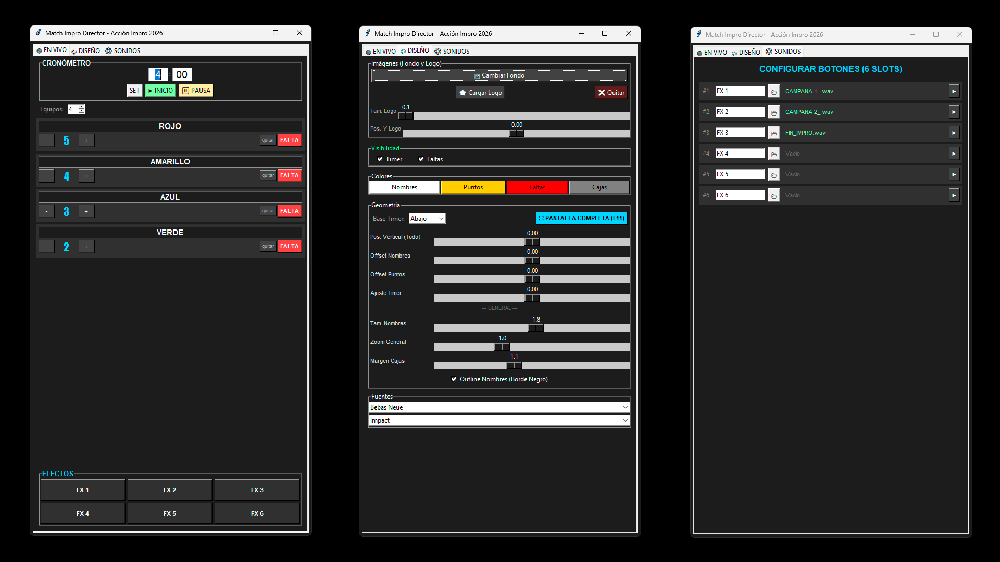

# 🎭 Match Impro Director - Ultimate Edition


Software profesional de dirección técnica diseñado específicamente para **Match de Improvisación**, competencias teatrales y eventos de artes escénicas en vivo. Desarrollado en Medellín, Colombia, por la **Corporación Acción Impro**.
## 📸 Vista Previa

| Tablero del Público | Panel de Control |
| :---: | :---: |
|  |  |
## ✨ Características Principales

- **Doble Pantalla (Multimonitor):** Controla todo desde tu laptop mientras el público ve solo el tablero profesional en el proyector.
- **Fullscreen Inteligente:** Soporte tipo navegador (F11) y doble clic para expandir el tablero exactamente en el monitor auxiliar.
- **Diseño Adaptable:** Cambia fondos (16:9, 4:3, 1:1), carga logos personalizados y ajusta la posición de cada elemento con precisión milimétrica.
- **Control en Vivo:** Edita nombres de equipos, suma puntos y gestiona faltas (máximo 3 con estilo semáforo) sin pausar el show.
- **Soundbar Integrada:** Lanzador de 6 slots de efectos de sonido (MP3/WAV) con nombres personalizables.
- **Cronómetro Flexible:** Reloj con cuenta regresiva que puedes ubicar arriba o abajo y ocultar según la dinámica del match.

## 🚀 Instalación y Uso

### Para Usuarios (Ejecutable)
1. Descarga el archivo `MatchDirector_AccionImpro.exe` desde la sección de **Releases**.
2. Conecta tu proyector o segunda pantalla en modo "Extender".
3. Abre la aplicación y arrastra la ventana del "Tablero Público" a la pantalla del público.
4. Haz **doble clic** sobre el tablero o presiona **F11** para ponerlo en pantalla completa.

### Para Programadores (Código Fuente)
El código está escrito en **Python 3.12**.
1. Clona el repositorio.
2. Instala las dependencias:
   ```bash

   pip install pillow pygame
