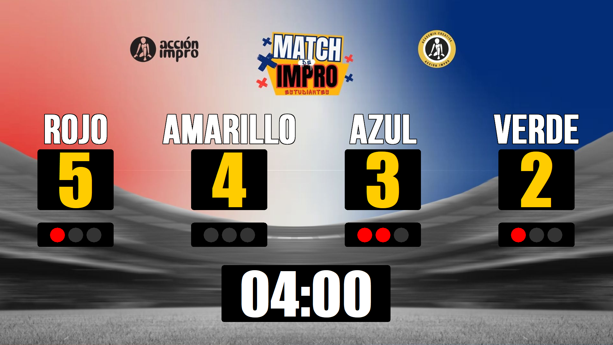
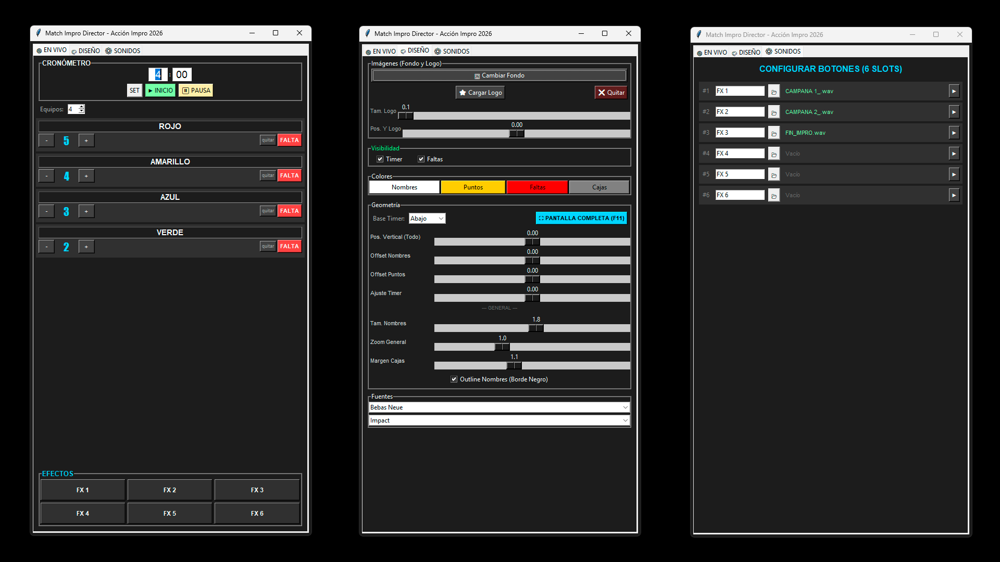

---
🌍 **Languages / Idiomas:** [English] | [Castellano](README.md)
---

# 🎭 Match Impro Director - Ultimate Edition

Professional technical suite designed for **Improvisational Match** shows, theater competitions, and live performing arts events. Developed in Medellín, Colombia, by **Corporación Acción Impro**.

## 📸 Preview

| Audience Scoreboard | Control Panel |
| :---: | :---: |
|  |  |

## ✨ Key Features

- **Dual Screen (Multimonitor):** Control everything from your laptop while the audience only sees the professional board on the projector.
- **Smart Fullscreen:** Browser-style support (F11) and double-click to expand the board exactly on the auxiliary monitor.
- **Flexible Design:** Supports various background ratios (16:9, 4:3, 1:1), customizable logos, and precise manual adjustment for every element.
- **Live Control:** Edit team names, update scores, and manage fouls (up to 3 with "traffic light" style) without pausing the show.
- **Integrated Soundbar:** 6-slot sound effect launcher (MP3/WAV) with customizable button names.
- **Configurable Timer:** Countdown clock that can be placed at the top or bottom, or hidden depending on the match dynamic.
- **WiFi Remote Control:** Drive scores, fouls, timer and sound effects from a phone or tablet instead of staying glued to the computer.

## 📡 Remote Control (WiFi Handheld)

Lets an assistant (or you, from the audience floor) run the scoreboard straight from a phone browser. Nothing to install on the phone and no internet required: everything stays inside your local network.

1. Connect the computer and the phone to the **same WiFi network**.
2. In the control panel open the **📡 REMOTO** tab and press **ENCENDER** (turn on).
3. Type the displayed address into the phone's browser (e.g. `http://192.168.1.20:8770`).
4. Enter the 6-digit **PIN** shown in the panel. The phone remembers it for next time.

The handheld can add/remove points, add and clear fouls, set the timer, start/pause it, and fire the 6 sound effects. The projector board updates instantly.

**Security notes**
- Anyone on that network can reach the handheld page, which is why it is PIN protected.
- On public or shared networks, generate a **new PIN** before the show with the 🔄 button.
- Turn the server off when the show ends.
- If Windows asks about the Firewall the first time, allow access on **private networks**.
- If port 8770 is taken, change it in the same tab (e.g. 8771).

## 🚀 Installation and Usage

### For Users (Executable)
1. Download the `MatchDirector_ByAccionImpro.zip` file from the **Releases** section.
2. Connect your projector or second screen in "Extend" mode.
3. Launch the app and drag the "Audience Scoreboard" window to the public screen.
4. **Double-click** on the board or press **F11** to enter fullscreen mode.

### For Developers (Source Code)
The code is written in **Python 3.12**.
1. Clone the repository.
2. Install dependencies: `pip install pillow pygame`
3. Run the main script: `python match_director_source.py`

> The remote control lives in `remote_control.py` and uses the **standard library only** (no extra dependencies). Keep that file next to `match_director_source.py`; if it is missing the program still starts, but the 📡 REMOTO tab stays disabled.

## 🎨 Customization
In the **DESIGN** tab you can:
- Change colors for names, scores, and fouls.
- Select system fonts.
- Adjust padding and corner radius of the containers.
- Toggle visibility of elements for "Friendly Matches" (No fouls/No timer).

## 📜 License and Credits

This software is distributed under the **Creative Commons Attribution 4.0 International (CC BY 4.0)** license.

**Attribution:**
Developed by **Corporación Acción Impro**, Medellín, Colombia, 2026.
[https://accionimpro.com.co/](https://accionimpro.com.co/)

---

*Made by and for improvisers.* 🎭
